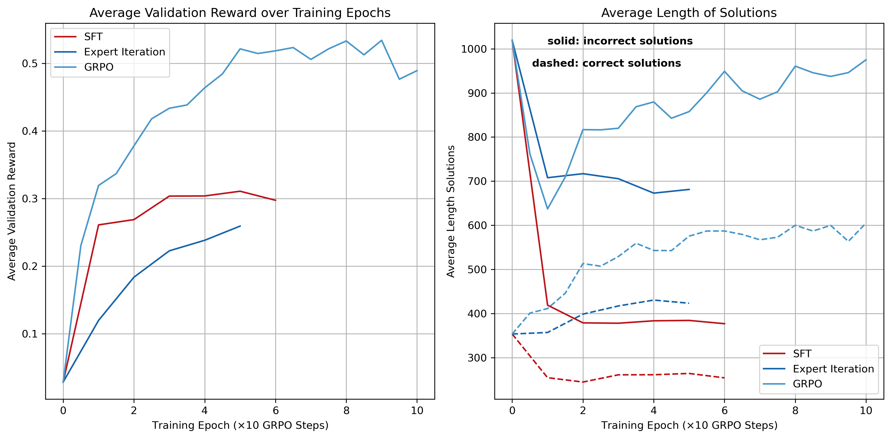
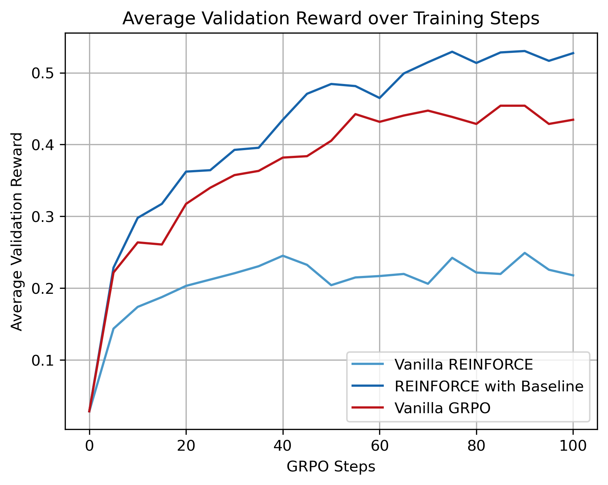
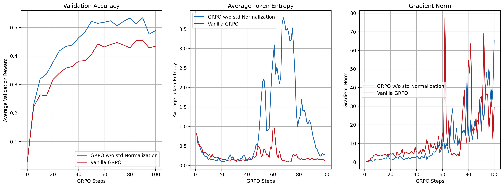
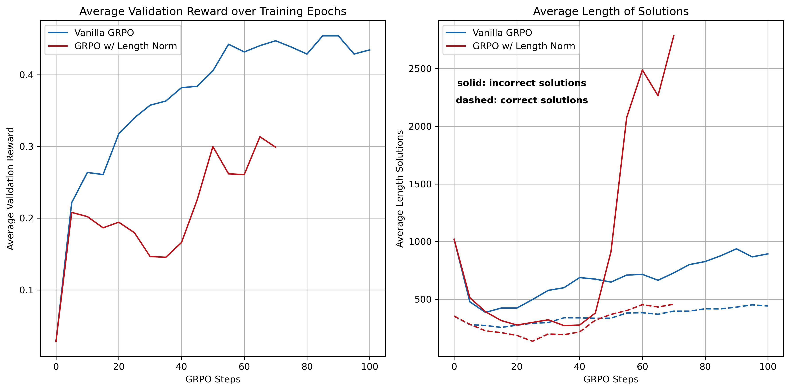
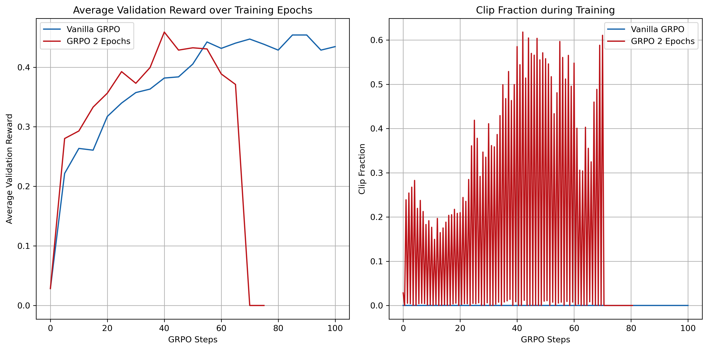

<div align="center">

# Reasoning Fine-tuning with SFT, Expert Iteration and GRPO

**A systematic study of reasoning fine-tuning methods for large language models**

[](https://www.python.org/)
[](https://pytorch.org/)
[](https://wandb.ai/)
[](LICENSE)

<br/>

_Implementations from scratch of SFT, Expert Iteration, and GRPO for mathematical reasoning,_
_fine-tuning Qwen2.5-Math-1.5B on the MATH benchmark._

<br/>

[Overview](#-overview) · [Methods](#-methods) · [Prompting](#-prompting-strategy) · [Results](#-results) · [GRPO Ablations](#-grpo-ablations) · [Usage](#-usage) · [References](#-references)

</div>

---

## 📌 Overview

The traditional way to improve chain-of-thought (CoT) reasoning in language models is to use supervised reasoning traces. However, rencently it has been demonstrated that reinforcement learning from verifiable rewards can induce strong CoT reasoning without the need of high-quality reasoning examples [[1]](#-references). This project motivates this paradigm shift by systematically comparing three training strategies for instilling mathematical reasoning in a 1.5B parameter model:

| Method               | Description                                      | Supervision                      |
| -------------------- | ------------------------------------------------ | -------------------------------- |
| **SFT**              | Fine-tune on high-quality CoT examples           | Training examples required       |
| **Expert Iteration** | Iterative rejection sampling + SFT               | Model produces training examples |
| **GRPO**             | Policy gradient with group-normalised advantages | Only verfiable reward            |

All algorithms are implemented from scratch, inspired by homework assignments from Stanford's [CS336](https://stanford-cs336.github.io/spring2025/) class, and trained on the [MATH dataset](https://github.com/hendrycks/math) [[6]](#-references) using [`Qwen/Qwen2.5-Math-1.5B`](https://huggingface.co/Qwen/Qwen2.5-Math-1.5B) [[7]](#-references) as the base model.

---

## 🔬 Methods

### Supervised Fine-Tuning (SFT)

The model is fine-tuned directly on curated (prompt, solution) pairs from a subset of the MATH dataset, where solutions include full chain-of-thought reasoning. This requires high-quality reasoning annotations.

### Expert Iteration (EI)

Expert iteration [[2]](#-references) alternates between two phases:

> **1. Rollout** — Sample $G$ candidate solutions from the current policy/language model per prompt
>
> **2. Selective Fine-tuning** — Fine-tune on the subset of responses that yielded correct answers

This iteratively improves the quality of the training distribution without having to rely on human-annotated reasoning traces. This is a natural bridge between pure SFT and RL-based methods.

### REINFORCE and GRPO (Group Relative Policy Optimisation)

In RLVR [[1]](#-references) reasoning fine-tuning is treated as a reinforcement learning problem with a verifiable binary reward. The language model with parameters $\theta$ is treated as a policy $\pi_\theta$, which given a current state $s_t$ (the input tokens) defines a distribution for the next action (the next token) $a_t \sim \pi_\theta (\cdot | s_t)$, where $\pi_\theta (a_t | s_t)$ is simply the softmax of the language model output for the next token to turn the logits into a probability. The reward $R(\tau)$ for a given trajectory $\tau$, i.e. the full rollout, is binary and one typically assigns a reward of $1$ to a correct answer and a reward of $0$ to an incorrect answer. All reinforcement learning problems have the goal to maximize the expected return in some form, i.e. we want to maximize an objective function of the form

$$ J(\theta) = \mathbb{E}_{\tau \sim \pi_\theta} [R(\tau)] = \sum_{\tau} P(\tau | \theta) R(\tau)\,. $$

In a language model $P(\tau | \theta) = \rho_0 (s_0) \prod_{t=0}^T P(s_{t+1} | s_t , a_t) \pi_\theta (a_t |s_t)$.
Using the simple log derivative trick $\nabla_\theta P = P \nabla_\theta \log P$, one finds the REINFORCE policy gradient

$$ \nabla_\theta J(\theta) = \mathbb{E}_{\tau \sim \pi_\theta} \left[\sum_{t=0}^T \nabla_\theta \log \pi_\theta (a_t | s_t) R(\tau) \right] $$

The expectation value can be approximated by sampling rollouts from the language model. There are two useful observations: i) when writing the expectation value as a Monte Carlo probe of the rollouts, this is equivalent to considering a loss function without the gradient and ii) we can add a reward baseline $b(s_t)$ which decreases the varience of the reward estimator. This gives two versions of the REINFORCE algorithm/loss

**Vanilla REINFORCE Loss**

$$ L(\theta ) = -\frac{1}{N} \sum_{i=1}^{N} \sum_{t=0}^T \log \pi_\theta (a^{(i)}_t | s^{(i)}_t) R(\tau^{(i)})$$

**REINFORCE Loss with Baseline**

$$ L(\theta ) = -\frac{1}{N} \sum_{i=1}^{N} \sum_{t=0}^T \log \pi_\theta (a^{(i)}_t | s^{(i)}_t) (R(\tau^{(i)}) - b(s^{(i)}_t))$$

The best choice is to use the state value function $V(s^{(i)}_t)$ which quantifies the average reward reached from state $s^{(i)}_t$. This is difficult to estimate for language models, which is why GRPO uses group advantages as baseline.

**GRPO Algorithm**

The GRPO algorithm picks a specific baseline and adds the capability for off-policy training, i.e. training on rollouts from an older version of the language model. The idea is the following: for each prompt, a group of $G$ responses is sampled from the current policy $\pi*{\theta*{\rm old}}. Advantages, i.e. baselines, are estimated by normalising rewards within each group — eliminating the need for a learned value network entirely:

$$\hat{A}_i   = \frac{r_i - \text{mean}(\mathbf{r})}{\text{std}(\mathbf{r}) + \varepsilon}, \quad \mathbf{r} = (r_1, \ldots, r_G)\,,$$

where $r_i$ are the rewards of the $i$-th group element. The full objective function is

$$ J(\theta ) = \mathbb{E}_{q\sim\mathcal{D},\, \{o^{(i)}\}_{i=1}^G \sim \pi_\theta (\cdot | q)} \left[ \frac{1}{G}\sum_{i=1}^G \frac{1}{|o^{(i)}|} \sum_{t=1}^{|o^{(i)}|} \min\left( \frac{\pi_\theta (o_t^{(i)}| q , o^{(i)}_{<t})}{\pi_{\theta_{\rm old}} (o_t^{(i)}| q , o^{(i)}_{<t})} A^{(i)} , \text{clip}\left(\frac{\pi_\theta (o_t^{(i)}| q , o^{(i)}_{<t})}{\pi_{\theta_{\rm old}} (o_t^{(i)}| q , o^{(i)}_{<t})}, 1-\epsilon, 1+\epsilon \right) A^{(i)}\right) \right]\,, $$

where $q$ are the questions and $o_t^{(i)}$ is the $i$-th model output at step $t$ in the trajectory. The policy ratios allow to go off-policy and are reminiscent of importance sampling. The clipping makes sure that we do not stray too far from the original policy. The original GRPO realization also had a KL loss term. However, recently it has been observed that the KL loss term is not needed [[5]](#-references).

Rollouts are generated efficiently using [vLLM](https://github.com/vllm-project/vllm), with weights synchronised from the HuggingFace training model at the start of each rollout phase.

### Grading and Rewards

In order to judge the correctness of the language model output we need a grader which also assigns rewards to outputs. We use a slightly modified version of the grader from the Dr. GRPO paper[[5]](#-references) which can be found at [github](https://github.com/sail-sg/understand-r1-zero/blob/main/understand_r1_zero/math_grader.py). The version tht we use was provided with Stanford's CS336 assignment and assigns a format reward of 1.0 if the answer complies with the R1-Zero prompt format and contains <think>, </think> and <answer>, </answer> tags. Additionally, it compares the answer between the answer tags to the ground truth and assigns an answer reward of 1.0 if it is correct. The total reward is the product of answer and format reward.

---

## 💬 Prompting Strategy

All methods use the **R1-Zero prompt format** [[1]](#-references), which instructs the model to put its reasoning within thinking tags before committing to a final answer:

```
A conversation between User and Assistant. The User asks a question, and the Assistant solves it. The Assistant first thinks about the reasoning process in the mind and then provides the User with the answer. The reasoning process is enclosed within <think> </think> and answer is enclosed within <answer> </answer> tags, respectively, i.e., <think> reasoning process here </think> <answer> answer here </answer>.
User: {question}
Assistant: <think>
```

This format enables exact-match evaluation of the `<answer>` tag contents without parsing the reasoning trace. The reward function is **binary** — a reward of 1 is assigned if the extracted answer matches the ground truth, and 0 otherwise.

---

## 📊 Results

### Method Comparison

As a first step we compare the validation accuracy of the best configurations of each training method on a subset of $1024$ questions in the validation set.

In the SFT approach we trained the model with a constant learning rate of $2\cdot 10^{-5}$ for $5$ epochs on all $1404$ examples in the training set, which pass the evaluation of our grader.

The expert iteration alogrithm is also run for $5$ epochs with a constant learning rate of $2\cdot 10^{-5}$. In each epoch we choose $128$ random questions in the train set and generate $30$ rollouts for each of them. We select all rollouts which pass the grader evaluation and perform SFT with them. Here we limit ourselves to $1$ epoch of SFT in each expert iteration step.

For the GRPO algorithm we perform $100$ GRPO steps, where in each step we take a random batch of $32$ questions (groups) from the training set and generate $8$ rollouts within each group. We then maximize the GRPO objective using a clip-range of $\epsilon = 0.2$, a constant learning rate of $3\cdot 10^{-5}$ and a slightly modified advantage definition, that omits the normalization with the standard deviation, inspired by the implementation in [[5]](#-references). Below we also study several ablations and motivate why this configuration gave the best results.

<div align="center">

</div>

There are a few important observations that follow from our results:

1. GRPO yields by far the best results and does not require human labeled data.
2. Expert iteration can yield comparable results to SFT on carefully curated question/answer examples. In fact, if we had trained longer under the expert iteration algorithm, it might have even outperformed SFT.
3. SFT produces the shortest answers no matter if they are correct or incorrect. This might be due to the training on curated question-answer pairs which are not arbitrarily long.
4. Answer lengths generated by a model fine-tuned with GRPO grow during the training time. As long as the growth is not abnormally large, this can be seen as the model improving its reasoning capabilities and producing more detailed answers.

---

## 🧪 GRPO Ablations

In the following we study several modifications of the GRPO algorithms to understand there effects on model training. Below we give a short summary of all variations that we study

| Ablation                    | Variants                                                   | Reference           |
| --------------------------- | ---------------------------------------------------------- | ------------------- |
| Loss objective              | Vanilla REINFORCE, REINFORCE with Baseline, GRPO Clip Loss | -                   |
| Advantage std normalisation | Enabled / disabled                                         | [[5]](#-references) |
| Length Normalization        | Normalization by output length                             | [[5]](#-references) |
| Off-policy                  | Several training Epochs per GRPO step                      | -                   |

All experiments are logged with [Weights & Biases](https://wandb.ai).

---

### GRPO Ablations

<b>Loss objective</b> — no baseline vs reinforce with baseline vs GRPO clip loss
<br/>

Instead of GRPO we can use a simpler algorithm, such as vanilla REINFORCE or REINFORCE with baseline. As baseline we use the advantage definition of the vanilla GRPO algorithm. These can be seen as a precursor to the more complex GRPO algorithm.

<div align="center">

</div>

This clearly shows that using a baseline significantly improves training performance (left plot). One of the reasons is that without baseline the model only learns from correct answers, since only those get a non-zero reward. However, when a baseline is used, incorrect answers get an effectively negative reward and we do a gradient step in the opposite direction. This is clearly visible in the gradient norms (right plot), where vanilla REINFORCE has significantly smaller gradient updates.

REINFORCE with Baseline and vanilla GRPO are almost identical for short GRPO steps with few training examples, since the model barely changes and GRPO is effectively on-policy the whole time. The difference in accuracy seen above could be a statistical fluctuation or it might show that the loss using logs in the REINFORCE objective is more stable than probability ratios in GRPO. This is also supported by the gradient norms during training (right plot) which is significantly noisier for GRPO.

<b>Advantage normalisation</b> — effect of std normalisation on training stability
<br/>

In the Dr. GRPO paper it was pointed out that the normalization with the standard deviation in the GRPO advantage definition introduces a bias towards easy and difficult problems, since in those cases the standard deviation will be small (almost all or almost no answers are correct), what boosts the advantage for those examples. Here we check how this affects the training.

<div align="center">

</div>

Removing the standard deviation as normalization indeed improves the performance considerably (left). In order to figure out why that is, it is worth checking some training metrics.

These plots give a hint why removing the standard deviation in the advantage definition might improve training performance. The plot of the gradient norm (right) shows that vanilla GRPO is slightly less stable with a consistently larger gradient norm and many large spikes in the later phases of training. Even though we clip gradients at a norm of $1.0$, this indicates that training is less stable with vanilla GRPO.

Another intersting metric is the average token entropy (middle) of the language model rollouts. A larger entropy signals that the model is less certain about its output, what is to some extent needed during training, since it favors exploration over exploitation. Removing the normalization allows the model to explore more during training, what can boost training performance.

It would be interesting to study how this improvement correlates with question difficulty.

<b>Length Normalization</b> — token-level loss averaging vs constant normalization by largest rollout length
<br/>

In the previous studies we have constructed the loss by using the average loss per token in each rollout. However, it is also possible to take the sum and normalize by the longest answer length. The comparison of vanilla GRPO and this ablation is shown below.

<div align="center">

</div>

The training with length normalization is less stable than vanilla GRPO, what is mainly due to the exploding length of incorrect model answers (right plot). Length normalization allows the model to reduce the loss for incorrect answers by making them longer.

<b>Off-Policy</b> — running GRPO more off-policy
<br/>

The clipping prescription makes it possible to run GRPO off-policy. Here we test the performance of an algorithm which goes through 2 epochs of training in each GRPO stop.

<div align="center">

</div>

At first the off-policy algorithm trains well with a relatively low clipping fraction (see right plot). The clipping fraction refers to the fraction of token losses which are clipped in the GRPO algorithm. However, as training progresses the clipping fraction increases until eventually the algorithm becomes unstable and the language model undergoes catastrophic forgetting. Nonetheless, the results look promising and a further tuning of hyperparameters could make the algorithm more stable.

---

## ⚙️ Installation

All experiments were performed with python version `Python 3.12.11`

```bash
# Clone the repository
git clone https://github.com/maxruhdorfer/Reasoning-Finetuning-SFT-EI-GRPO.git
cd Reasoning-Finetuning-SFT-EI-GRPO

# Install dependencies
pip install -r requirements.txt

# Log in to Weights & Biases
wandb login
```

> **Hardware note:** Experiments were run on a single A100 80GB GPU. Smaller GPUs may require reducing `--gpu_memory_utilization` and `--rollout_batch_size`.

---

## 🚀 Usage

### SFT Training

```bash
python sft.py \
    --train_dataset data/MATH/sft.jsonl \
    --val_dataset data/MATH/validation.jsonl \
    --batch_size 4 \
    --gradient_accumulation_steps 4 \
    --lr 2e-5 \
    --num_epochs 6 \
    --run_name my_sft_run
```

---

#### Key Arguments

| Argument                        | Default                      | Description                                                                    |
| ------------------------------- | ---------------------------- | ------------------------------------------------------------------------------ |
| `--train_dataset`               | `data/MATH/sft.jsonl`        | Path to SFT training dataset (`.jsonl`)                                        |
| `--val_dataset`                 | `data/MATH/validation.jsonl` | Path to validation dataset (`.jsonl`)                                          |
| `--prompt_path`                 | `prompts/r1_zero.prompt`     | Path to prompt template (uses `{question}` placeholder)                        |
| `--batch_size`                  | `4`                          | Dataloader batch size per step                                                 |
| `--gradient_accumulation_steps` | `4`                          | Number of microbatches before an optimizer step                                |
| `--lr`                          | `2e-5`                       | AdamW learning rate                                                            |
| `--num_epochs`                  | `6`                          | Number of full passes over the training dataset                                |
| `--num_sft_examples`            | `None`                       | Randomly subsample $N$ examples from the training set (uses full set if unset) |
| `--filter_correct`              | `False`                      | If `True`, discard examples where the response does not match the ground truth |
| `--output`                      | `logs`                       | Root directory for run outputs and model checkpoint                            |
| `--run_name`                    | auto-generated               | W&B run name and output subdirectory name                                      |

### Expert Iteration Training

```bash
python expert_iteration.py \
    --train_dataset data/MATH/train.jsonl \
    --val_dataset data/MATH/validation.jsonl \
    --ei_steps 5 \
    --ei_batch 128 \
    --num_rollouts 10 \
    --num_epochs 1 \
    --batch_size 4 \
    --gradient_accumulation_steps 4 \
    --lr 2e-5 \
    --run_name my_ei_run
```

---

#### Key Arguments

| Argument                        | Default                      | Description                                                      |
| ------------------------------- | ---------------------------- | ---------------------------------------------------------------- |
| `--train_dataset`               | `data/MATH/train.jsonl`      | Path to training dataset (`.jsonl`)                              |
| `--val_dataset`                 | `data/MATH/validation.jsonl` | Path to validation dataset (`.jsonl`)                            |
| `--prompt_path`                 | `prompts/r1_zero.prompt`     | Path to prompt template (uses `{question}` placeholder)          |
| `--ei_steps`                    | `5`                          | Number of expert iteration steps (rollout → filter → SFT cycles) |
| `--ei_batch`                    | `128`                        | Number of prompts sampled from the training set per EI step      |
| `--num_rollouts`                | `10`                         | Number of responses generated per prompt during rollout          |
| `--num_epochs`                  | `1`                          | SFT epochs run on the filtered correct responses each EI step    |
| `--batch_size`                  | `4`                          | Dataloader batch size for SFT                                    |
| `--gradient_accumulation_steps` | `4`                          | Number of microbatches before an optimizer step                  |
| `--lr`                          | `2e-5`                       | AdamW learning rate                                              |
| `--output`                      | `logs`                       | Root directory for run outputs and model checkpoint              |
| `--run_name`                    | auto-generated               | W&B run name and output subdirectory name                        |

### GRPO Training

```bash
python grpo.py \
    --train_dataset data/MATH/train.jsonl \
    --val_dataset data/MATH/validation.jsonl \
    --loss_type grpo_clip \
    --group_size 8 \
    --rollout_batch_size 256 \
    --train_batch_size 256 \
    --gradient_accumulation_steps 128 \
    --learning_rate 3e-5 \
    --n_grpo_steps 100 \
    --use_std_normalization \
    --eval_interval 5 \
    --run_name my_grpo_run
```

#### Key Arguments

| Argument                        | Default                      | Description                                                              |
| ------------------------------- | ---------------------------- | ------------------------------------------------------------------------ |
| `--train_dataset`               | `data/MATH/train.jsonl`      | Path to training dataset (`.jsonl`)                                      |
| `--val_dataset`                 | `data/MATH/validation.jsonl` | Path to validation dataset (`.jsonl`)                                    |
| `--loss_type`                   | `reinforce_with_baseline`    | `no_baseline`, `reinforce_with_baseline`, or `grpo_clip`                 |
| `--group_size`                  | `8`                          | Number of responses sampled per prompt $G$                               |
| `--rollout_batch_size`          | `256`                        | Total responses generated per GRPO step                                  |
| `--train_batch_size`            | `256`                        | Total responses used for the training update                             |
| `--gradient_accumulation_steps` | `128`                        | Microbatch accumulation steps; `micro_batch = train_batch / accum_steps` |
| `--learning_rate`               | `3e-5`                       | AdamW learning rate                                                      |
| `--n_grpo_steps`                | `100`                        | Number of GRPO steps to run                                              |
| `--use_std_normalization`       | `False`                      | Normalise advantages by within-group std                                 |
| `--use_length_normalization`    | `False`                      | Sequence-level loss normalisation                                        |
| `--epochs_per_rollout_batch`    | `1`                          | Training epochs per rollout batch (>1 = off-policy)                      |
| `--cliprange`                   | `0.2`                        | Clip range $\varepsilon$ for `grpo_clip`                                 |
| `--sampling_temperature`        | `1.0`                        | Rollout sampling temperature                                             |
| `--sampling_max_tokens`         | `1024`                       | Maximum tokens generated per rollout                                     |
| `--sampling_min_tokens`         | `4`                          | Minimum tokens generated per rollout                                     |
| `--gpu_memory_utilization`      | `0.4`                        | vLLM GPU memory fraction                                                 |
| `--beta`                        | `0.0`                        | Entropy bonus coefficient (annealed over training)                       |
| `--advantage_eps`               | `1e-6`                       | Epsilon added to std for numerical stability in advantage normalization  |
| `--eval_interval`               | `5`                          | Evaluate every $N$ GRPO steps                                            |
| `--eval_samples`                | `None`                       | Number of validation samples to use (defaults to full set)               |
| `--prompt_path`                 | `prompts/r1_zero.prompt`     | Path to prompt template (uses `{question}` placeholder)                  |
| `--output`                      | `logs`                       | Root directory for run outputs and checkpoints                           |
| `--run_name`                    | auto-generated               | W&B run name and output subdirectory name                                |
| `--save_model`                  | `False`                      | Save model checkpoint after training                                     |

---

## 🗂️ Repository Structure

```
.
├── grpo.py                     # Main GRPO training loop with ablation flags
├── sft.py                      # SFT training loop
├── expert_iteration.py         # Expert iteration training loop
├── aux.py                      # Utilities: vLLM init, tokenisation, log-prob computation, eval
├── drgrpo_grader.py            # Reward function for the R1-Zero format
├── evaluate_zeroShot.py        # Evaluates the zero-shot accuracy of the Qwen base model before training
├── plots.ipynb                 # Generate plots of results
├── README.md                   # Readme file
├── requirements.txt            # Python package requirements
├── prompts/
│   └── r1_zero.prompt          # Prompt template
├── data/
│   └── MATH/                   # Training data
│       ├── sft.jsonl
│       ├── train.jsonl
│       └── validation.jsonl
└── logs/                      # Training outputs and eval logs (generated at runtime)
```

---

## 📚 References

[1] Guo et al. _DeepSeek-R1: Incentivizing Reasoning Capability in LLMs via Reinforcement Learning._ 2025. https://arxiv.org/abs/2501.12948

[2] Anthony et al. _Thinking Fast and Slow with Deep Learning and Tree Search._ NeurIPS 2017. https://arxiv.org/abs/1705.08439

[3] Schulman et al. _Proximal Policy Optimization Algorithms._ 2017. https://arxiv.org/abs/1707.06347

[4] Yu et al. _DAPO: An Open-Source LLM Reinforcement Learning System at Scale._ 2025. https://arxiv.org/abs/2503.14476

[5] Liu et al. _Dr. GRPO: Decomposed Relative Policy Optimization._ 2025. https://arxiv.org/abs/2503.20783

[6] Hendrycks et al. _Measuring Mathematical Problem Solving With the MATH Dataset._ NeurIPS 2021. https://arxiv.org/abs/2103.03874

[7] Qwen Team. _Qwen2.5-Math Technical Report._ 2024. https://arxiv.org/abs/2412.15115

---

<div align="center">
<sub>MIT License · Built with PyTorch & vLLM</sub>
</div>
